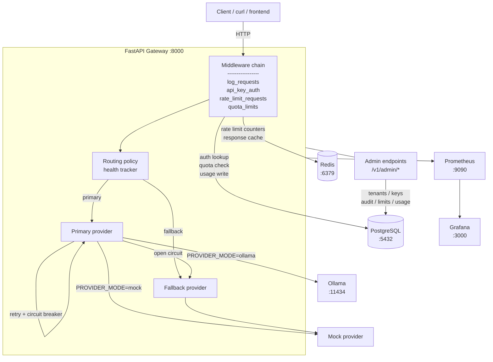
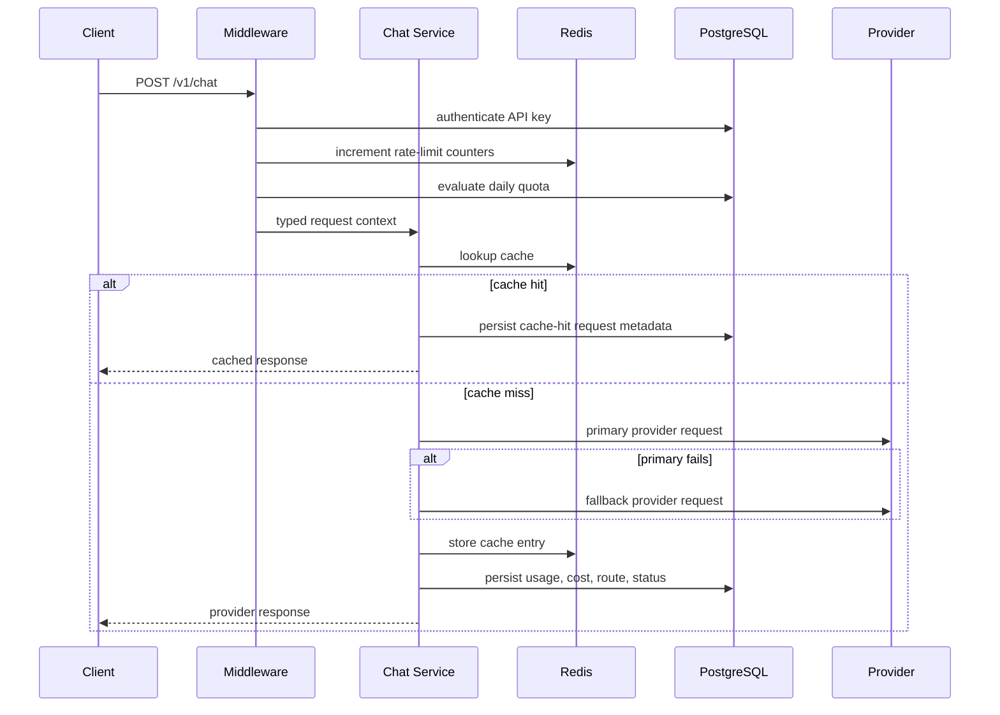

# llm-gateway

`llm-gateway` is a self-hosted FastAPI gateway for multi-tenant LLM access. It sits in front of local or mock providers, authenticates tenants with API keys, applies routing and fallback decisions, enforces rate limits and daily quotas, supports SSE streaming, records usage, and exposes observability endpoints for Prometheus and Grafana.

## Features

- Multi-tenant API key auth with admin bootstrap, key rotation, revocation, and audit logging
- Health-aware provider routing with fallback and circuit-breaker backed retries
- Standard and streaming chat endpoints with SSE responses
- Redis-backed rate limiting and response caching
- Per-tenant token and spend quotas
- Prometheus metrics, Grafana dashboards, and optional OpenTelemetry tracing
- Docker Compose stack for local development
- Browser-based admin and tenant management UI in `frontend/`

## Architecture

| Component | Role |
| --- | --- |
| FastAPI app | Chat API, admin API, health endpoints, metrics, static UI hosting |
| PostgreSQL + SQLAlchemy | Tenants, API keys, requests, usage, and admin actions |
| Redis | Rate limiting counters and cached chat responses |
| Ollama | Local model inference when `PROVIDER_MODE=ollama` |
| Mock provider | Deterministic local fallback for tests and demos |
| Prometheus | Metrics scraping from `/metrics` |
| Grafana | Dashboards for request, provider, quota, and cache visibility |
| Static frontend | Admin, tenants, keys, and chat pages served by FastAPI |

## Architecture Diagram



## Repository Layout

| Path | Purpose |
| --- | --- |
| `app/main.py` | Minimal entrypoint that exposes `app = create_app()` |
| `app/bootstrap.py` | FastAPI app factory, lifespan, middleware, provider setup |
| `app/routers/` | Route handlers split by domain |
| `app/services/` | Business logic and orchestration |
| `app/db/` | SQLAlchemy models, repositories, and session management |
| `frontend/` | Static HTML/CSS/JS UI served by the backend |
| `tests/` | Unit and integration tests |
| `prometheus/` | Prometheus scrape config |
| `grafana/` | Provisioned dashboards and datasources |
| `alembic/` | Database migrations |

## Quick Start

### Docker Compose

```bash
git clone <your-fork-url>
cd llm-gateway
cp .env.example .env
docker compose up --build
```

Services exposed locally:

- API: `http://localhost:8000`
- Prometheus: `http://localhost:9090`
- Grafana: `http://localhost:3001`
- PostgreSQL: `localhost:1312`
- Redis: `localhost:6379`

### Development Without Docker

```bash
poetry install --with dev
cp .env.example .env
poetry run uvicorn app.main:app --reload
```

For local app-only development you still need PostgreSQL and Redis available at the URLs in `.env`, or you can switch to mock mode and point `DATABASE_URL` and `REDIS_URL` to local services.

## Environment Variables

See [.env.example](./.env.example) for a copy-pasteable local template.

Key settings:

- `DATABASE_URL`
- `REDIS_URL`
- `ADMIN_API_KEY`
- `BOOTSTRAP_ADMIN_TOKEN`
- `API_KEY_PEPPER`
- `PROVIDER_MODE`
- `OLLAMA_URL`
- `OPENAI_API_KEY`

## API Endpoints

| Method | Path | Auth | Description |
| --- | --- | --- | --- |
| `GET` | `/health` | None | Basic liveness probe |
| `GET` | `/ready` | None | Readiness probe with dependency checks |
| `GET` | `/metrics` | None | Prometheus metrics endpoint |
| `POST` | `/v1/chat` | API key | Standard chat completion request |
| `POST` | `/v1/chat/stream` | API key | SSE streaming chat completion request |
| `POST` | `/v1/admin/tenants` | Admin key | Create a tenant |
| `GET` | `/v1/admin/tenants` | Admin key | List tenants |
| `POST` | `/v1/admin/keys` | Admin key | Create an API key for a tenant |
| `GET` | `/v1/admin/audit` | Admin key | List recent admin actions |
| `GET` | `/v1/admin/usage/{tenant_name}` | Admin key | Get request, token, and cost totals |

## Usage Examples

Create a tenant:

```bash
curl -X POST http://localhost:8000/v1/admin/tenants \
  -H "Authorization: Bearer ${ADMIN_API_KEY}" \
  -H "Content-Type: application/json" \
  -d '{"tenant":"ollama-test","tier":"free"}'
```

Create an API key:

```bash
curl -X POST http://localhost:8000/v1/admin/keys \
  -H "Authorization: Bearer ${ADMIN_API_KEY}" \
  -H "Content-Type: application/json" \
  -d '{"tenant":"ollama-test","name":"cli"}'
```

Call the chat endpoint:

```bash
curl -X POST http://localhost:8000/v1/chat \
  -H "Authorization: Bearer ${TENANT_API_KEY}" \
  -H "Content-Type: application/json" \
  -d '{
    "model":"ignored-by-router",
    "messages":[{"role":"user","content":"Explain how this gateway routes requests."}]
  }'
```

## Development

Run the local quality checks:

```bash
poetry run ruff check .
poetry run mypy app tests scripts
poetry run pytest tests/
```

Apply database migrations:

```bash
poetry run alembic upgrade head
```

## Load Testing

Locust scripts live in `evals/locustfile.py`:

```bash
pip install locust
locust -f evals/locustfile.py --host http://localhost:8000
```

Typical mock-provider results on a laptop-scale setup:

| Metric | Value |
| --- | --- |
| p50 `/v1/chat` | ~5 ms |
| p95 `/v1/chat` | ~15 ms |
| Throughput | ~400 req/s (mock, no Ollama) |
| Rate-limit 429 at 60 req/min/tenant | confirmed |

## Engineering Evidence

This repo is intended to show more than endpoint wiring. The gateway is structured to surface the operating tradeoffs that usually get buried in demos:

- Request policy is enforced before chat execution, with fail-closed behavior when Redis-backed rate limiting is unavailable.
- Provider routing is explicit and health-aware, with fallback metrics and request persistence for post-failure review.
- Request metadata is stored with route and cache decisions so troubleshooting does not depend on logs alone.
- CI runs linting, type checking, tests, and coverage on each push and pull request.

Recent local verification on this machine:

| Check | Result |
| --- | --- |
| `poetry run ruff check .` | pass |
| `poetry run mypy app tests scripts` | pass |
| `poetry run pytest tests/` | 55 passed |
| `poetry run pytest --cov=app --cov-report=term-missing` | 76% app coverage |

## Failure Modes

The gateway is designed to make failure behavior explicit instead of hiding it behind generic 500s:

- Redis unavailable during rate limiting: requests fail closed with a dependency error instead of silently bypassing limits.
- Primary provider failure: request falls back to the configured secondary provider and records the route reason.
- Both providers fail: request is persisted as failed with stage and failure code metadata.
- Corrupt cache entry: cached value is evicted and the request is recomputed.
- Daily token or spend quota exhausted: request is rejected with remaining-budget headers when available.

See [docs/FAILURE_MODES.md](./docs/FAILURE_MODES.md) for the full matrix.

## Request Flow



## Production Tradeoffs

- The app uses synchronous SQLAlchemy sessions inside async handlers. That keeps the local stack simple, but an async session layer would be the next step for higher concurrency.
- Rate limiting and response caching depend on Redis. If Redis is unavailable, the gateway fails closed for rate limits instead of silently allowing traffic.
- Provider routing is rule-based and health-driven, not policy-engine driven. That keeps behavior easy to inspect but limits dynamic routing sophistication.
- Admin bootstrap is environment-seeded. This is convenient for local and demo environments, but a production deployment should source bootstrap secrets from a managed secret store.
- Cost estimation is deterministic and table-based. It is suitable for demos and guardrails, but not a substitute for provider-billed usage reconciliation.

## Deployment

The repo is optimized for local Docker Compose, but the same shape ports cleanly to a single-host deployment:

1. Build and push the API image.
2. Provision PostgreSQL and Redis as managed services.
3. Inject runtime secrets through the host or orchestrator environment, not a committed `.env`.
4. Run migrations with `poetry run alembic upgrade head` before shifting traffic.
5. Put the app behind a reverse proxy with TLS termination and request timeouts.
6. Scrape `/metrics` from Prometheus and import the provided Grafana dashboard.

See [docs/OPERATIONS.md](./docs/OPERATIONS.md), [docs/DEPLOYMENT.md](./docs/DEPLOYMENT.md), and [ARCHITECTURE.md](./ARCHITECTURE.md).

For a production-shaped example deployment, see `deploy/k8s/`.

## Notes

- Admin credentials are seeded from environment variables on startup. Rotating the admin key through the API requires updating `ADMIN_API_KEY` in your environment before the next restart if you want the rotated key to persist.
